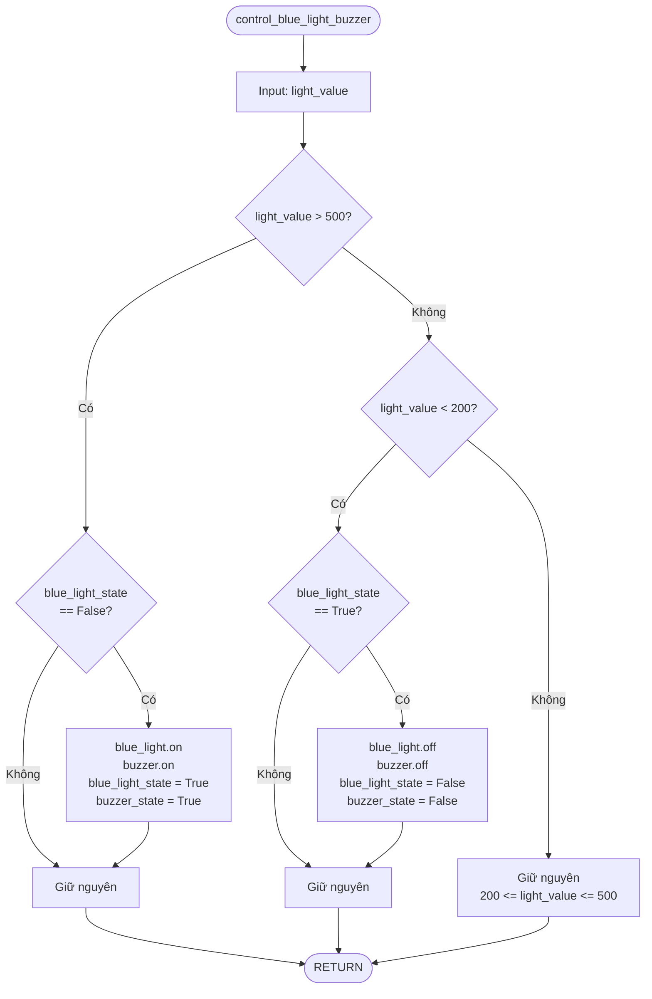
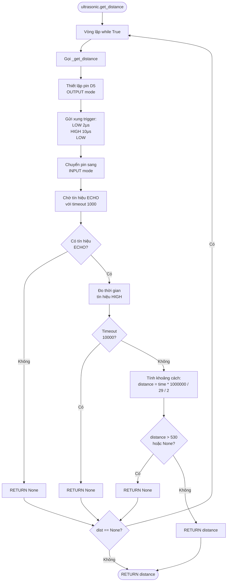
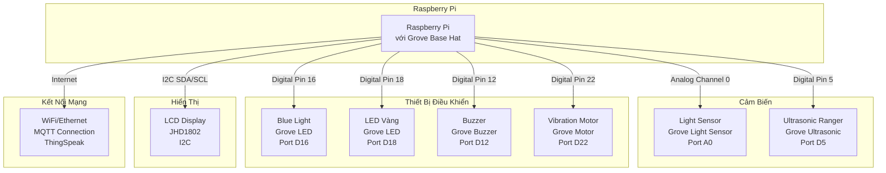
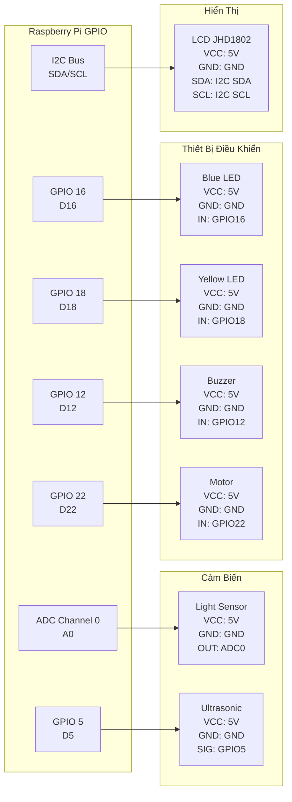

# Lưu Đồ Giải Thuật - Hệ Thống Giám Sát Ánh Sáng và Khoảng Cách

## Flowchart Tổng Quan

```mermaid
flowchart TD
    Start([BẮT ĐẦU]) --> LoadCreds[Đọc MQTT credentials<br/>từ file send_data_mqtt_key.txt]
    LoadCreds --> InitMQTT[Khởi tạo MQTT Client<br/>và kết nối đến ThingSpeak]
    InitMQTT --> InitSensors[Khởi tạo các cảm biến:<br/>- Light Sensor A0<br/>- Ultrasonic D5<br/>- Blue Light D16<br/>- LED Vàng D18<br/>- Buzzer D12<br/>- Motor Rung D22<br/>- LCD Display]
    InitSensors --> InitVars[Khởi tạo biến trạng thái:<br/>blue_light_state = False<br/>led_yellow_state = False<br/>buzzer_state = False<br/>motor_state = False<br/>last_display_time = now]
    InitVars --> PrintHeader[In thông tin hệ thống<br/>ra màn hình]
    PrintHeader --> MainLoop{Vòng lặp chính}
    
    MainLoop --> ReadLight[Đọc cảm biến ánh sáng<br/>light_sensor.value]
    ReadLight --> CheckLightError{Lỗi đọc<br/>ánh sáng?}
    CheckLightError -->|Có| SetLightZero[light_value = 0]
    CheckLightError -->|Không| ReadDistance[Đọc cảm biến khoảng cách<br/>ultrasonic.get_distance]
    SetLightZero --> ReadDistance
    
    ReadDistance --> CheckDistError{Lỗi đọc<br/>khoảng cách?}
    CheckDistError -->|Có| SetDistZero[distance = 0]
    CheckDistError -->|Không| ControlBlueLight[Điều khiển Blue Light & Buzzer]
    SetDistZero --> ControlBlueLight
    
    ControlBlueLight --> ControlLogic1{light_value > 500?}
    ControlLogic1 -->|Có| TurnOnBlue[Blue Light ON<br/>Buzzer ON]
    ControlLogic1 -->|Không| ControlLogic2{light_value < 200?}
    ControlLogic2 -->|Có| TurnOffBlue[Blue Light OFF<br/>Buzzer OFF]
    ControlLogic2 -->|Không| ControlYellowLED[Giữ nguyên trạng thái]
    TurnOnBlue --> ControlYellowLED
    TurnOffBlue --> ControlYellowLED
    
    ControlYellowLED --> ControlLogic3{distance < 20cm?}
    ControlLogic3 -->|Có| TurnOnYellow[LED Vàng ON<br/>Motor Rung ON]
    ControlLogic3 -->|Không| ControlLogic4{distance > 40cm?}
    ControlLogic4 -->|Có| TurnOffYellow[LED Vàng OFF<br/>Motor Rung OFF]
    ControlLogic4 -->|Không| CheckDisplayTime[Giữ nguyên trạng thái]
    TurnOnYellow --> CheckDisplayTime
    TurnOffYellow --> CheckDisplayTime
    
    CheckDisplayTime --> TimeCheck{Đã đủ<br/>20 giây?}
    TimeCheck -->|Chưa| Sleep[Chờ 1 giây<br/>time.sleep READ_INTERVAL]
    TimeCheck -->|Đã đủ| DisplayTerminal[Hiển thị dữ liệu<br/>ra Terminal:<br/>- Thời gian<br/>- Ánh sáng<br/>- Khoảng cách<br/>- Trạng thái các thiết bị]
    
    DisplayTerminal --> DisplayLCD[Hiển thị trên LCD:<br/>Dòng 1: Light: XXXX<br/>Dòng 2: Dist: XX.Xcm]
    DisplayLCD --> SendMQTT[Gửi dữ liệu lên ThingSpeak<br/>qua MQTT:<br/>field1=light_value<br/>field2=distance]
    SendMQTT --> CheckMQTTError{Lỗi gửi<br/>MQTT?}
    CheckMQTTError -->|Có| PrintError[In thông báo lỗi]
    CheckMQTTError -->|Không| UpdateTime[last_display_time = current_time]
    PrintError --> UpdateTime
    UpdateTime --> Sleep
    
    Sleep --> CheckInterrupt{Có tín hiệu<br/>Ctrl+C?}
    CheckInterrupt -->|Không| MainLoop
    CheckInterrupt -->|Có| Cleanup[Tắt tất cả thiết bị:<br/>- Blue Light OFF<br/>- LED Vàng OFF<br/>- Buzzer OFF<br/>- Motor Rung OFF]
    Cleanup --> StopMQTT[Dừng MQTT loop<br/>và ngắt kết nối]
    StopMQTT --> End([KẾT THÚC])
```



## Flowchart Chi Tiết - Điều Khiển Blue Light & Buzzer



## Flowchart Chi Tiết - Điều Khiển LED Vàng & Motor Rung


## Flowchart Chi Tiết - Đọc Cảm Biến Khoảng Cách



## Mô Tả Các Bước Chính

### 1. Khởi Tạo Hệ Thống
- Đọc thông tin xác thực MQTT từ file `send_data_mqtt_key.txt`
- Kết nối đến ThingSpeak MQTT broker
- Khởi tạo tất cả cảm biến và thiết bị điều khiển
- Thiết lập các biến trạng thái ban đầu

### 2. Vòng Lặp Chính
- **Đọc cảm biến mỗi 1 giây (READ_INTERVAL)**
  - Đọc cảm biến ánh sáng (0-1000)
  - Đọc cảm biến khoảng cách (cm)
  
- **Điều khiển thiết bị theo logic:**
  - Blue Light & Buzzer: BẬT khi ánh sáng > 500, TẮT khi < 200
  - LED Vàng & Motor Rung: BẬT khi khoảng cách < 20cm, TẮT khi > 40cm
  
- **Hiển thị và gửi dữ liệu mỗi 20 giây (DISPLAY_INTERVAL)**
  - Hiển thị trên Terminal
  - Hiển thị trên LCD
  - Gửi lên ThingSpeak qua MQTT

### 3. Xử Lý Lỗi
- Xử lý lỗi đọc cảm biến (gán giá trị mặc định)
- Xử lý lỗi hiển thị LCD
- Xử lý lỗi gửi MQTT

### 4. Kết Thúc
- Xử lý tín hiệu Ctrl+C
- Tắt tất cả thiết bị
- Ngắt kết nối MQTT
- Thoát chương trình

## Các Ngưỡng Điều Khiển

| Thiết Bị | Điều Kiện BẬT | Điều Kiện TẮT | Giữ Nguyên |
|----------|---------------|---------------|------------|
| Blue Light & Buzzer | Ánh sáng > 500 | Ánh sáng < 200 | 200 ≤ Ánh sáng ≤ 500 |
| LED Vàng & Motor Rung | Khoảng cách < 20cm | Khoảng cách > 40cm | 20cm ≤ Khoảng cách ≤ 40cm |

## Thời Gian

- **READ_INTERVAL**: 1 giây (đọc cảm biến)
- **DISPLAY_INTERVAL**: 20 giây (hiển thị và gửi dữ liệu)

---

# Sơ Đồ Nguyên Lý Kết Nối Dây

## Sơ Đồ Tổng Quan Hệ Thống



## Sơ Đồ Chi Tiết Kết Nối Grove Base Hat

```
┌─────────────────────────────────────────────────────────────┐
│                    GROVE BASE HAT FOR RASPBERRY PI          │
├─────────────────────────────────────────────────────────────┤
│                                                               │
│  ┌─────┐  ┌─────┐  ┌─────┐  ┌─────┐  ┌─────┐  ┌─────┐       │
│  │ A0  │  │ A1  │  │ A2  │  │ A3  │  │ A4  │  │ A5  │       │
│  └─────┘  └─────┘  └─────┘  └─────┘  └─────┘  └─────┘       │
│    │                                                          │
│    └─── Light Sensor (Analog)                                │
│                                                               │
│  ┌─────┐  ┌─────┐  ┌─────┐  ┌─────┐  ┌─────┐  ┌─────┐       │
│  │ D3  │  │ D4  │  │ D5  │  │ D6  │  │ D7  │  │ D8  │       │
│  └─────┘  └─────┘  └─────┘  └─────┘  └─────┘  └─────┘       │
│              │                                                │
│              └─── Ultrasonic Ranger (Digital)                │
│                                                               │
│  ┌─────┐  ┌─────┐  ┌─────┐  ┌─────┐  ┌─────┐  ┌─────┐       │
│  │ D9  │  │ D10 │  │ D11 │  │ D12 │  │ D13 │  │ D14 │       │
│  └─────┘  └─────┘  └─────┘  └─────┘  └─────┘  └─────┘       │
│                        │                                      │
│                        └─── Buzzer                            │
│                                                               │
│  ┌─────┐  ┌─────┐  ┌─────┐  ┌─────┐  ┌─────┐  ┌─────┐       │
│  │ D15 │  │ D16 │  │ D17 │  │ D18 │  │ D19 │  │ D20 │       │
│  └─────┘  └─────┘  └─────┘  └─────┘  └─────┘  └─────┘       │
│              │                        │                        │
│              └─── Blue Light          └─── LED Vàng           │
│                                                               │
│  ┌─────┐  ┌─────┐  ┌─────┐  ┌─────┐  ┌─────┐  ┌─────┐       │
│  │ D21 │  │ D22 │  │ D23 │  │ D24 │  │ D25 │  │ D26 │       │
│  └─────┘  └─────┘  └─────┘  └─────┘  └─────┘  └─────┘       │
│              │                                                │
│              └─── Vibration Motor                             │
│                                                               │
│  ┌─────────────────────────────────────────────────────┐    │
│  │              I2C CONNECTOR                           │    │
│  │  ┌────┐  ┌────┐  ┌────┐  ┌────┐                      │    │
│  │  │SDA │  │SCL │  │VCC │  │GND │                      │    │
│  │  └────┘  └────┘  └────┘  └────┘                      │    │
│  │                                                       │    │
│  │              └─── LCD Display JHD1802                │    │
│  └─────────────────────────────────────────────────────┘    │
│                                                               │
└─────────────────────────────────────────────────────────────┘
```

## Bảng Kết Nối Chi Tiết

| Thiết Bị | Loại Grove | Port | Chân GPIO | Chức Năng | Mô Tả |
|----------|------------|------|-----------|-----------|-------|
| **Light Sensor** | Analog | A0 | ADC Channel 0 | Đọc cường độ ánh sáng | Đo giá trị 0-1000 |
| **Ultrasonic Ranger** | Digital | D5 | GPIO 5 | Đọc khoảng cách | Đo khoảng cách 2-400cm |
| **Blue Light** | Digital | D16 | GPIO 16 | Điều khiển LED xanh | BẬT/TẮT theo ánh sáng |
| **LED Vàng** | Digital | D18 | GPIO 18 | Điều khiển LED vàng | BẬT/TẮT theo khoảng cách |
| **Buzzer** | Digital | D12 | GPIO 12 | Điều khiển còi | BẬT/TẮT theo ánh sáng |
| **Vibration Motor** | Digital | D22 | GPIO 22 | Điều khiển motor rung | BẬT/TẮT theo khoảng cách |
| **LCD Display** | I2C | I2C | SDA/SCL | Hiển thị dữ liệu | Hiển thị ánh sáng và khoảng cách |

## Sơ Đồ Kết Nối Grove Connector

### Analog Port (A0) - Light Sensor
```
┌─────────────────┐
│  GROVE CONNECTOR │
├─────────────────┤
│  Pin 1: VCC     │ ──── 5V
│  Pin 2: GND     │ ──── GND
│  Pin 3: Signal  │ ──── ADC Channel 0
│  Pin 4: NC      │
└─────────────────┘
```

### Digital Port (D5) - Ultrasonic Ranger
```
┌─────────────────┐
│  GROVE CONNECTOR │
├─────────────────┤
│  Pin 1: VCC     │ ──── 5V
│  Pin 2: GND     │ ──── GND
│  Pin 3: Signal  │ ──── GPIO 5 (Trigger/Echo)
│  Pin 4: NC      │
└─────────────────┘
```

### Digital Port (D12, D16, D18, D22) - LED, Buzzer, Motor
```
┌─────────────────┐
│  GROVE CONNECTOR │
├─────────────────┤
│  Pin 1: VCC     │ ──── 5V/3.3V
│  Pin 2: GND     │ ──── GND
│  Pin 3: Signal  │ ──── GPIO (12/16/18/22)
│  Pin 4: NC      │
└─────────────────┘
```

### I2C Port - LCD Display
```
┌─────────────────┐
│  GROVE CONNECTOR │
├─────────────────┤
│  Pin 1: VCC     │ ──── 5V
│  Pin 2: GND     │ ──── GND
│  Pin 3: SDA     │ ──── I2C SDA (GPIO 2)
│  Pin 4: SCL     │ ──── I2C SCL (GPIO 3)
└─────────────────┘
```

## Sơ Đồ Nguyên Lý Điện



## Hướng Dẫn Kết Nối

### Bước 1: Lắp Grove Base Hat
1. Tắt nguồn Raspberry Pi
2. Lắp Grove Base Hat lên Raspberry Pi (khớp với GPIO header)
3. Đảm bảo các chân GPIO được kết nối đúng

### Bước 2: Kết Nối Cảm Biến
1. **Light Sensor** → Cắm vào **Port A0** (Analog)
2. **Ultrasonic Ranger** → Cắm vào **Port D5** (Digital)

### Bước 3: Kết Nối Thiết Bị Điều Khiển
1. **Blue Light** → Cắm vào **Port D16**
2. **LED Vàng** → Cắm vào **Port D18**
3. **Buzzer** → Cắm vào **Port D12**
4. **Vibration Motor** → Cắm vào **Port D22**

### Bước 4: Kết Nối LCD Display
1. **LCD JHD1802** → Cắm vào **I2C Port** (bất kỳ I2C port nào trên Base Hat)

### Bước 5: Kiểm Tra Kết Nối
- Kiểm tra tất cả các connector đã được cắm chặt
- Kiểm tra nguồn điện (5V) cho các thiết bị
- Kiểm tra kết nối GND chung

## Lưu Ý Quan Trọng

⚠️ **An toàn điện:**
- Luôn tắt nguồn trước khi kết nối/tháo thiết bị
- Kiểm tra điện áp: Grove Base Hat cung cấp 5V cho các port
- Không kết nối sai cực (VCC/GND)

⚠️ **Tương thích:**
- Tất cả thiết bị phải là Grove modules
- LCD phải hỗ trợ I2C (JHD1802)
- Ultrasonic Ranger phải là loại single-pin (D5)

⚠️ **Phần cứng:**
- Raspberry Pi phải có Grove Base Hat được lắp đặt
- Đảm bảo Grove Base Hat tương thích với model Raspberry Pi
- Kiểm tra jumper I2C nếu cần thiết

