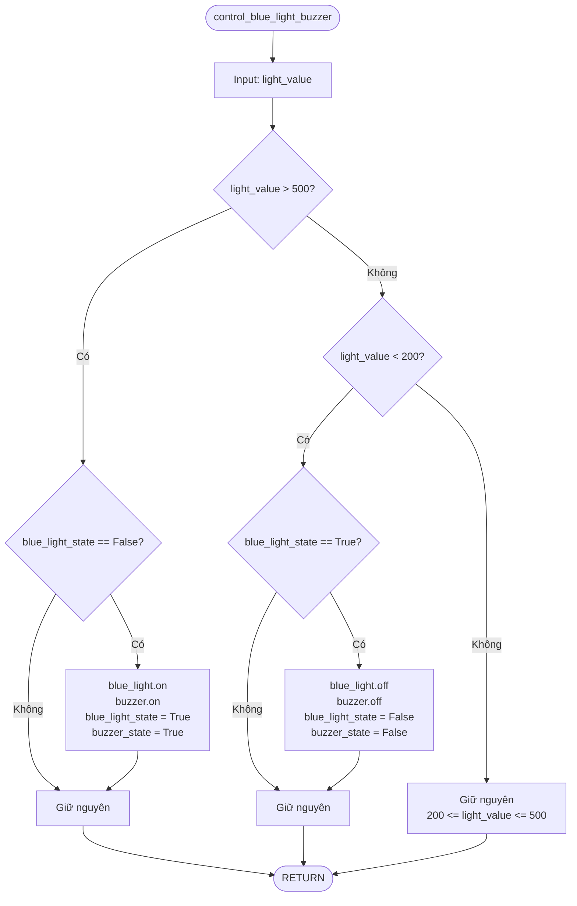
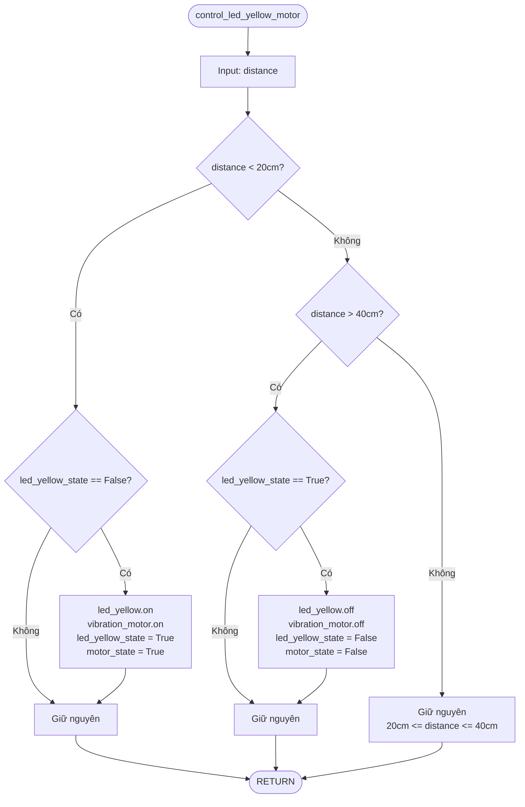
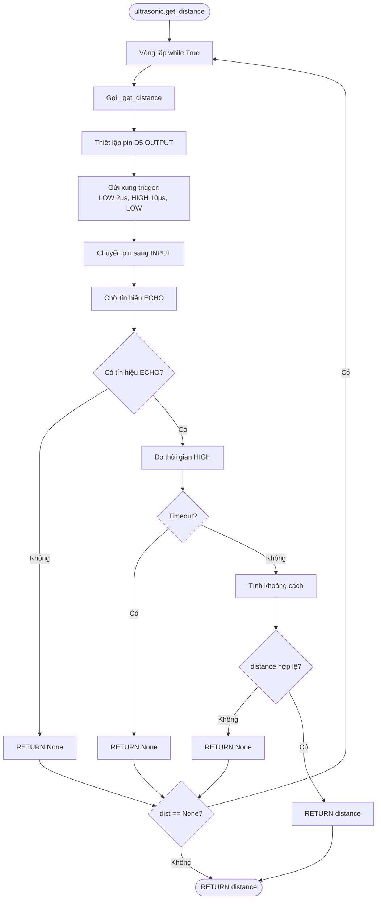
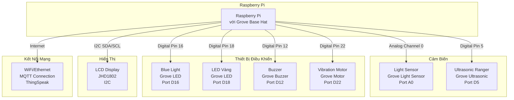
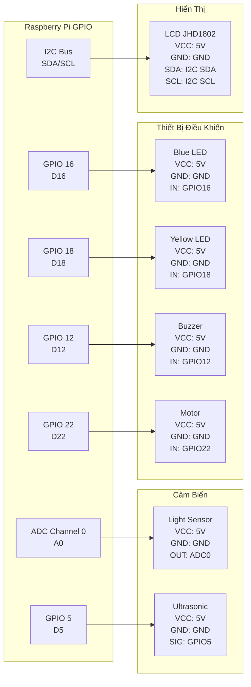

# Lưu Đồ Giải Thuật - Hệ Thống Giám Sát Ánh Sáng và Khoảng Cách

## Flowchart Tổng Quan

```mermaid
flowchart TD
    Start([BẮT ĐẦU]) --> LoadCreds[Đọc MQTT credentials]
    LoadCreds --> InitMQTT[Kết nối ThingSpeak MQTT]
    InitMQTT --> InitSensors[Khởi tạo cảm biến và thiết bị]
    InitSensors --> InitVars[Khởi tạo biến trạng thái]
    InitVars --> MainLoop{Vòng lặp chính}
    
    MainLoop --> ReadLight[Đọc cảm biến ánh sáng]
    ReadLight --> CheckLightError{Lỗi?}
    CheckLightError -->|Có| SetLightZero[light_value = 0]
    CheckLightError -->|Không| ReadDistance[Đọc cảm biến khoảng cách]
    SetLightZero --> ReadDistance
    
    ReadDistance --> CheckDistError{Lỗi?}
    CheckDistError -->|Có| SetDistZero[distance = 0]
    CheckDistError -->|Không| ControlBlueLight[Điều khiển Blue Light & Buzzer]
    SetDistZero --> ControlBlueLight
    
    ControlBlueLight --> ControlLogic1{light_value > 500?}
    ControlLogic1 -->|Có| TurnOnBlue[Blue Light ON<br/>Buzzer ON]
    ControlLogic1 -->|Không| ControlLogic2{light_value < 200?}
    ControlLogic2 -->|Có| TurnOffBlue[Blue Light OFF<br/>Buzzer OFF]
    ControlLogic2 -->|Không| ControlYellowLED[Giữ nguyên]
    TurnOnBlue --> ControlYellowLED
    TurnOffBlue --> ControlYellowLED
    
    ControlYellowLED --> ControlLogic3{distance < 20cm?}
    ControlLogic3 -->|Có| TurnOnYellow[LED Vàng ON<br/>Motor Rung ON]
    ControlLogic3 -->|Không| ControlLogic4{distance > 40cm?}
    ControlLogic4 -->|Có| TurnOffYellow[LED Vàng OFF<br/>Motor Rung OFF]
    ControlLogic4 -->|Không| CheckDisplayTime[Giữ nguyên]
    TurnOnYellow --> CheckDisplayTime
    TurnOffYellow --> CheckDisplayTime
    
    CheckDisplayTime --> TimeCheck{Đã đủ 20 giây?}
    TimeCheck -->|Chưa| Sleep[Chờ 1 giây]
    TimeCheck -->|Đủ| DisplayTerminal[Hiển thị Terminal]
    DisplayTerminal --> DisplayLCD[Hiển thị LCD]
    DisplayLCD --> SendMQTT[Gửi MQTT lên ThingSpeak]
    SendMQTT --> UpdateTime[Cập nhật thời gian]
    UpdateTime --> Sleep
    
    Sleep --> CheckInterrupt{Ctrl+C?}
    CheckInterrupt -->|Không| MainLoop
    CheckInterrupt -->|Có| Cleanup[Tắt thiết bị]
    Cleanup --> StopMQTT[Ngắt kết nối MQTT]
    StopMQTT --> End([KẾT THÚC])
```



## Flowchart Chi Tiết - Điều Khiển Blue Light & Buzzer



## Flowchart Chi Tiết - Điều Khiển LED Vàng & Motor Rung



## Flowchart Chi Tiết - Đọc Cảm Biến Khoảng Cách



## Ngưỡng Điều Khiển

| Thiết Bị | BẬT | TẮT |
|----------|-----|-----|
| Blue Light & Buzzer | Ánh sáng > 500 | Ánh sáng < 200 |
| LED Vàng & Motor Rung | Khoảng cách < 20cm | Khoảng cách > 40cm |

## Thời Gian

- **READ_INTERVAL**: 1 giây | **DISPLAY_INTERVAL**: 20 giây

---

# Sơ Đồ Nguyên Lý Kết Nối Dây

## Sơ Đồ Tổng Quan Hệ Thống



## Sơ Đồ Chi Tiết Kết Nối Grove Base Hat

```
┌─────────────────────────────────────────────────────────────┐
│                    GROVE BASE HAT FOR RASPBERRY PI          │
├─────────────────────────────────────────────────────────────┤
│                                                               │
│  ┌─────┐  ┌─────┐  ┌─────┐  ┌─────┐  ┌─────┐  ┌─────┐       │
│  │ A0  │  │ A1  │  │ A2  │  │ A3  │  │ A4  │  │ A5  │       │
│  └─────┘  └─────┘  └─────┘  └─────┘  └─────┘  └─────┘       │
│    │                                                          │
│    └─── Light Sensor (Analog)                                │
│                                                               │
│  ┌─────┐  ┌─────┐  ┌─────┐  ┌─────┐  ┌─────┐  ┌─────┐       │
│  │ D3  │  │ D4  │  │ D5  │  │ D6  │  │ D7  │  │ D8  │       │
│  └─────┘  └─────┘  └─────┘  └─────┘  └─────┘  └─────┘       │
│              │                                                │
│              └─── Ultrasonic Ranger (Digital)                │
│                                                               │
│  ┌─────┐  ┌─────┐  ┌─────┐  ┌─────┐  ┌─────┐  ┌─────┐       │
│  │ D9  │  │ D10 │  │ D11 │  │ D12 │  │ D13 │  │ D14 │       │
│  └─────┘  └─────┘  └─────┘  └─────┘  └─────┘  └─────┘       │
│                        │                                      │
│                        └─── Buzzer                            │
│                                                               │
│  ┌─────┐  ┌─────┐  ┌─────┐  ┌─────┐  ┌─────┐  ┌─────┐       │
│  │ D15 │  │ D16 │  │ D17 │  │ D18 │  │ D19 │  │ D20 │       │
│  └─────┘  └─────┘  └─────┘  └─────┘  └─────┘  └─────┘       │
│              │                        │                        │
│              └─── Blue Light          └─── LED Vàng           │
│                                                               │
│  ┌─────┐  ┌─────┐  ┌─────┐  ┌─────┐  ┌─────┐  ┌─────┐       │
│  │ D21 │  │ D22 │  │ D23 │  │ D24 │  │ D25 │  │ D26 │       │
│  └─────┘  └─────┘  └─────┘  └─────┘  └─────┘  └─────┘       │
│              │                                                │
│              └─── Vibration Motor                             │
│                                                               │
│  ┌─────────────────────────────────────────────────────┐    │
│  │              I2C CONNECTOR                           │    │
│  │  ┌────┐  ┌────┐  ┌────┐  ┌────┐                      │    │
│  │  │SDA │  │SCL │  │VCC │  │GND │                      │    │
│  │  └────┘  └────┘  └────┘  └────┘                      │    │
│  │                                                       │    │
│  │              └─── LCD Display JHD1802                │    │
│  └─────────────────────────────────────────────────────┘    │
│                                                               │
└─────────────────────────────────────────────────────────────┘
```

## Bảng Kết Nối Chi Tiết

| Thiết Bị | Port | GPIO | Chức Năng |
|----------|------|------|-----------|
| Light Sensor | A0 | ADC0 | Đọc ánh sáng (0-1000) |
| Ultrasonic Ranger | D5 | GPIO5 | Đọc khoảng cách |
| Blue Light | D16 | GPIO16 | Điều khiển LED xanh |
| LED Vàng | D18 | GPIO18 | Điều khiển LED vàng |
| Buzzer | D12 | GPIO12 | Điều khiển còi |
| Vibration Motor | D22 | GPIO22 | Điều khiển motor rung |
| LCD Display | I2C | SDA/SCL | Hiển thị dữ liệu |

## Sơ Đồ Kết Nối Grove Connector

**Analog Port (A0)**: VCC=5V, GND, Signal=ADC0  
**Digital Port (D5/D12/D16/D18/D22)**: VCC=5V, GND, Signal=GPIO  
**I2C Port**: VCC=5V, GND, SDA=GPIO2, SCL=GPIO3

## Sơ Đồ Nguyên Lý Điện



## Hướng Dẫn Kết Nối

1. **Lắp Grove Base Hat** lên Raspberry Pi (tắt nguồn trước)
2. **Cảm biến**: Light Sensor → A0, Ultrasonic → D5
3. **Thiết bị**: Blue Light → D16, LED Vàng → D18, Buzzer → D12, Motor → D22
4. **LCD**: JHD1802 → I2C Port
5. **Kiểm tra**: Cắm chặt connector, kiểm tra nguồn 5V và GND

## Lưu Ý

⚠️ **An toàn**: Tắt nguồn trước khi kết nối/tháo, kiểm tra cực VCC/GND  
⚠️ **Tương thích**: Tất cả thiết bị phải là Grove modules, LCD hỗ trợ I2C  
⚠️ **Phần cứng**: Grove Base Hat phải tương thích với Raspberry Pi

