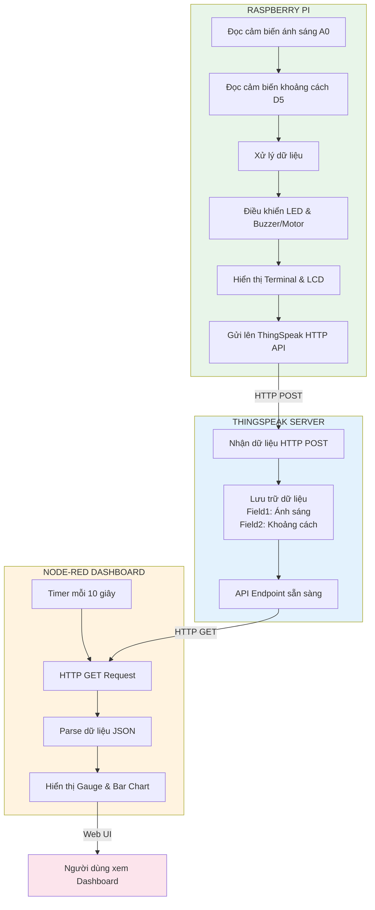
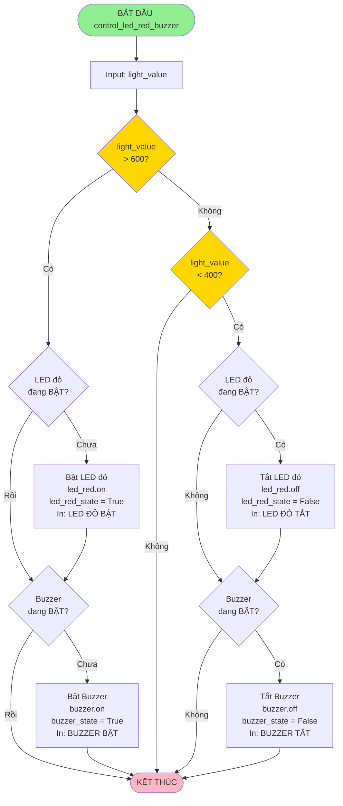
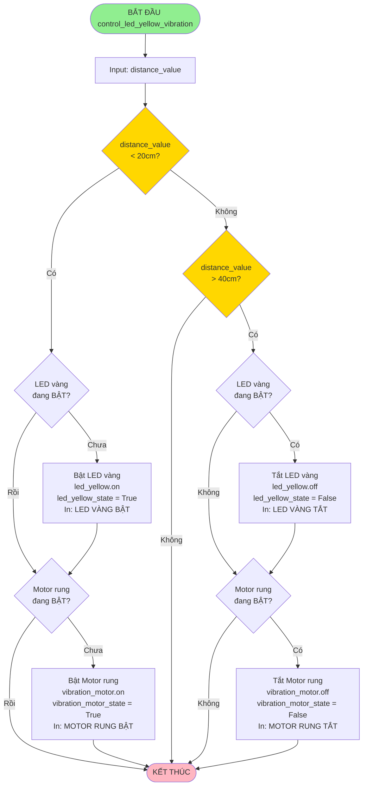
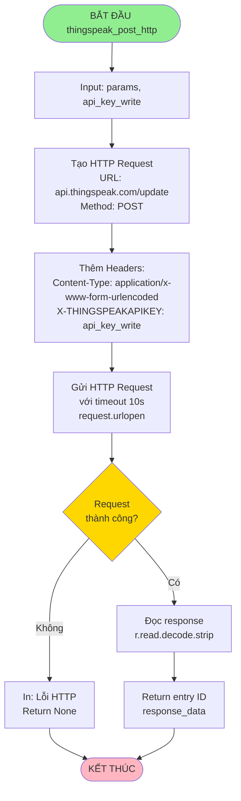
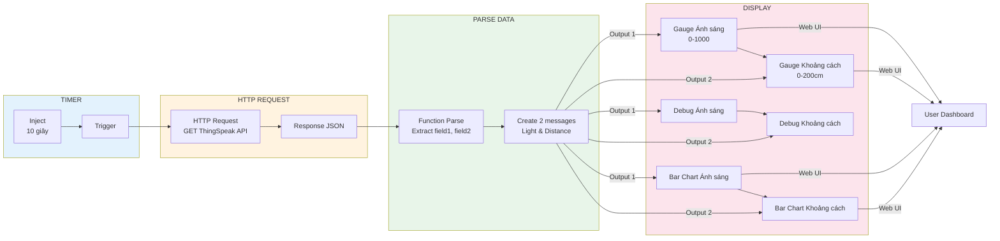
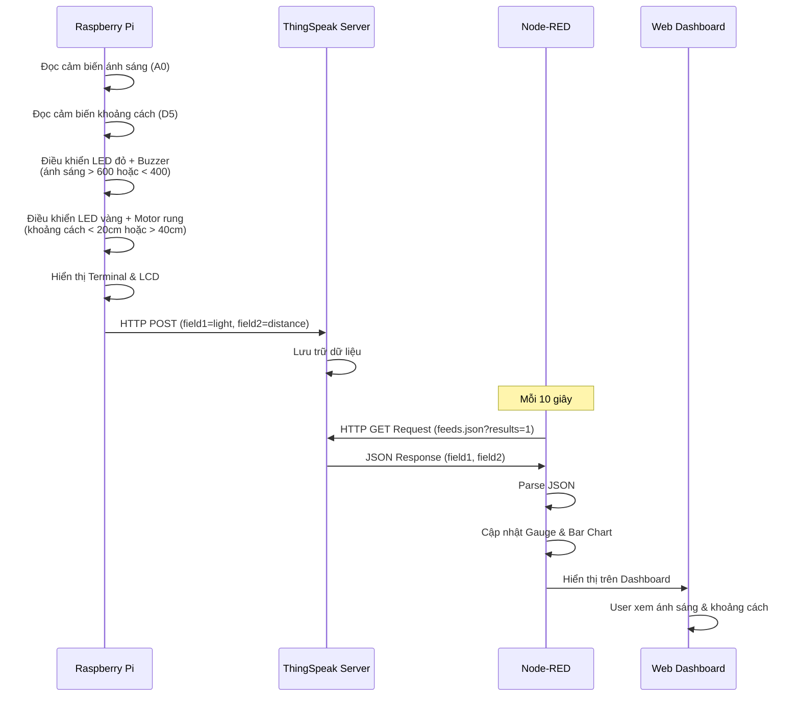
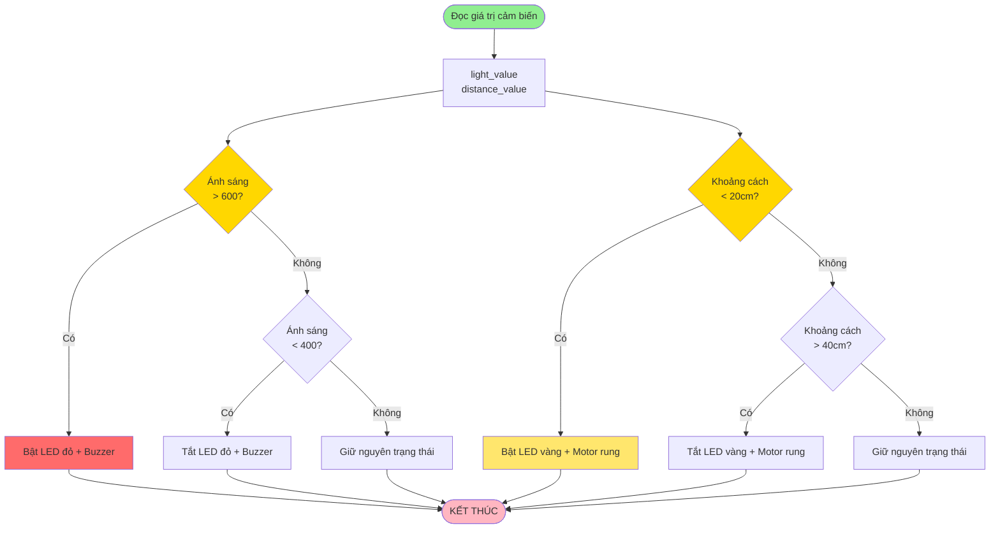

# Lưu đồ giải thuật - Hệ thống giám sát ánh sáng và khoảng cách với ThingSpeak HTTP

## 1. Lưu đồ tổng quan hệ thống



## 2. Lưu đồ chương trình Python (Raspberry Pi) - Chương trình chính

```mermaid
flowchart TD
    Start([BẮT ĐẦU]) --> Init[Khởi tạo:<br/>- Light Sensor A0<br/>- Ultrasonic Sensor D5<br/>- LED đỏ D16, LED vàng D18<br/>- Buzzer D12<br/>- Vibration Motor D13<br/>- LCD I2C]
    Init --> PrintStart[In thông báo khởi động<br/>Hiển thị ngưỡng điều khiển]
    PrintStart --> InitLCD[Khởi tạo LCD<br/>Hiển thị 'Initializing...']
    InitLCD --> SetVars[Khởi tạo biến:<br/>READ_INTERVAL = 10s<br/>last_sent_ts = 0<br/>API_KEY_WRITE]
    SetVars --> Loop{Vòng lặp chính<br/>While True}
    
    Loop --> ReadLight[Đọc cảm biến ánh sáng<br/>light_value = light_sensor.value]
    ReadLight --> CheckLightError{Lỗi đọc<br/>ánh sáng?}
    
    CheckLightError -->|Có| SetLightZero[light_value = 0<br/>In lỗi]
    CheckLightError -->|Không| ReadDistance[Đọc cảm biến khoảng cách<br/>distance_value = ultrasonic_sensor.get_distance]
    
    SetLightZero --> ReadDistance
    ReadDistance --> CheckDistError{Lỗi đọc<br/>khoảng cách?}
    
    CheckDistError -->|Có| SetDistZero[distance_value = 0<br/>In lỗi]
    CheckDistError -->|Không| DisplayTerminal[Hiển thị Terminal:<br/>- Cường độ ánh sáng<br/>- Khoảng cách]
    
    SetDistZero --> DisplayTerminal
    DisplayTerminal --> DisplayLCD[Gọi display_on_lcd<br/>Hiển thị trên LCD 16x2]
    
    DisplayLCD --> ControlRedBuzzer[Gọi control_led_red_buzzer<br/>Điều khiển LED đỏ + Buzzer]
    ControlRedBuzzer --> ControlYellowVib[Gọi control_led_yellow_vibration<br/>Điều khiển LED vàng + Motor rung]
    
    ControlYellowVib --> CheckTime{Đã qua<br/>10 giây?<br/>now - last_sent_ts >= 10}
    
    CheckTime -->|Chưa| Sleep10[Chờ 10 giây<br/>sleep READ_INTERVAL]
    CheckTime -->|Có| CheckAPIKey{API_KEY_WRITE<br/>đã cấu hình?}
    
    CheckAPIKey -->|Chưa| PrintWarning[In cảnh báo:<br/>Chưa cấu hình API Key]
    CheckAPIKey -->|Có| PrepareParams[Tạo params HTTP<br/>make_param_thingspeak<br/>field1=light_value<br/>field2=distance_value]
    
    PrintWarning --> UpdateTime[last_sent_ts = now]
    PrepareParams --> SendHTTP[Gửi HTTP POST<br/>thingspeak_post_http]
    
    SendHTTP --> CheckResp{Response<br/>thành công?<br/>resp != '0'}
    
    CheckResp -->|Có| PrintSuccess[In: Đã gửi dữ liệu<br/>entry id: resp]
    CheckResp -->|Không| PrintFail[In: Update thất bại]
    
    PrintSuccess --> UpdateTime
    PrintFail --> UpdateTime
    UpdateTime --> Sleep10
    Sleep10 --> Loop
    
    Loop -.->|Ctrl+C| Interrupt[Nhận KeyboardInterrupt]
    Interrupt --> Cleanup[Tắt tất cả thiết bị:<br/>- LED đỏ OFF<br/>- LED vàng OFF<br/>- Buzzer OFF<br/>- Motor rung OFF<br/>- LCD: 'System OFF']
    Cleanup --> End([KẾT THÚC])
    
    style Start fill:#90EE90
    style End fill:#FFB6C1
    style Loop fill:#87CEEB
    style CheckTime fill:#FFD700
    style CheckAPIKey fill:#FFD700
    style CheckResp fill:#FFD700
```



## 3. Lưu đồ điều khiển LED đỏ và Buzzer



## 4. Lưu đồ điều khiển LED vàng và Motor rung



## 5. Lưu đồ gửi dữ liệu lên ThingSpeak (HTTP POST)



## 6. Lưu đồ Node-RED nhận và hiển thị dữ liệu (HTTP)

```mermaid
flowchart TD
    Start([BẮT ĐẦU Node-RED Flow]) --> InitTimer[Inject Timer<br/>Repeat: 10 giây]
    InitTimer --> Trigger[Kích hoạt mỗi 10 giây]
    
    Trigger --> HTTPRequest[HTTP Request Node<br/>GET: api.thingspeak.com/channels/CHANNEL_ID/feeds.json<br/>results=1&api_key=READ_API_KEY]
    
    HTTPRequest --> CheckResponse{Response<br/>thành công?}
    
    CheckResponse -->|Không| Error[Debug Error]
    Error --> Wait[Chờ lần trigger tiếp theo]
    
    CheckResponse -->|Có| ParseJSON[Function: Parse JSON<br/>Lấy feeds[0]]
    ParseJSON --> CheckFeeds{feeds<br/>có dữ liệu?}
    
    CheckFeeds -->|Không| ReturnNull[Return null]
    CheckFeeds -->|Có| ExtractData[Lấy field1 và field2<br/>Parse sang float<br/>lightValue = parseFloat field1<br/>distanceValue = parseFloat field2]
    
    ExtractData --> CheckValid{Giá trị<br/>hợp lệ?<br/>!isNaN}
    
    CheckValid -->|Không| ReturnNull
    CheckValid -->|Có| CreateMessages[Tạo 2 messages:<br/>msgLight: payload=lightValue, topic='light'<br/>msgDistance: payload=distanceValue, topic='distance']
    
    CreateMessages --> OutputLight[Output 1: Ánh sáng]
    CreateMessages --> OutputDistance[Output 2: Khoảng cách]
    
    OutputLight --> UpdateGaugeLight[Cập nhật Gauge Ánh sáng<br/>0-1000]
    OutputLight --> UpdateBarLight[Cập nhật Bar Chart Ánh sáng]
    OutputLight --> DebugLight[Debug: Ánh sáng]
    
    OutputDistance --> UpdateGaugeDist[Cập nhật Gauge Khoảng cách<br/>0-200cm]
    OutputDistance --> UpdateBarDist[Cập nhật Bar Chart Khoảng cách]
    OutputDistance --> DebugDist[Debug: Khoảng cách]
    
    UpdateGaugeLight --> Wait
    UpdateBarLight --> Wait
    UpdateGaugeDist --> Wait
    UpdateBarDist --> Wait
    DebugLight --> Wait
    DebugDist --> Wait
    ReturnNull --> Wait
    Wait --> Trigger
    
    style Start fill:#90EE90
    style CheckResponse fill:#FFD700
    style CheckFeeds fill:#FFD700
    style CheckValid fill:#FFD700
    style UpdateGaugeLight fill:#4ECDC4
    style UpdateGaugeDist fill:#4ECDC4
    style UpdateBarLight fill:#95E1D3
    style UpdateBarDist fill:#95E1D3
```

## 7. Lưu đồ chi tiết Node-RED Flow



## 8. Lưu đồ luồng dữ liệu tổng thể (HTTP)



## 9. Lưu đồ logic điều khiển thiết bị



## Mô tả các thành phần:

### Raspberry Pi (Python):
- **Cảm biến ánh sáng**: Grove Light Sensor (A0) - giá trị 0-1000
- **Cảm biến khoảng cách**: Grove Ultrasonic Ranger (D5) - đơn vị cm
- **LED đỏ**: Grove LED (D16) - bật khi ánh sáng > 600, tắt khi < 400
- **LED vàng**: Grove LED (D18) - bật khi khoảng cách < 20cm, tắt khi > 40cm
- **Buzzer**: Grove Buzzer (D12) - hoạt động cùng LED đỏ
- **Motor rung**: Grove Vibration Motor (D13) - hoạt động cùng LED vàng
- **LCD**: Grove LCD 16x2 I2C - hiển thị ánh sáng và khoảng cách
- **Gửi dữ liệu**: HTTP POST lên ThingSpeak mỗi 10 giây
- **Đọc cảm biến**: Mỗi 10 giây

### ThingSpeak Server:
- **Nhận dữ liệu**: Qua HTTP POST từ Raspberry Pi
- **Lưu trữ**: 
  - Field1: Cường độ ánh sáng (0-1000)
  - Field2: Khoảng cách vật cản (cm)
- **API Endpoint**: `https://api.thingspeak.com/channels/[CHANNEL_ID]/feeds.json`

### Node-RED Dashboard (HTTP):
- **Timer**: Inject node kích hoạt mỗi 10 giây
- **HTTP Request**: GET dữ liệu từ ThingSpeak API
- **Parse**: Chuyển đổi JSON sang số (lightValue, distanceValue)
- **Hiển thị**: 
  - Gauge cho ánh sáng (0-1000)
  - Gauge cho khoảng cách (0-200cm)
  - Bar Chart cho ánh sáng
  - Bar Chart cho khoảng cách
- **Truy cập**: `http://localhost:1880/ui` hoặc `http://[IP]:1880/ui`

### Logic điều khiển:
- **LED đỏ + Buzzer**: 
  - Bật khi ánh sáng > 600
  - Tắt khi ánh sáng < 400
  - Giữ nguyên khi 400 ≤ ánh sáng ≤ 600
- **LED vàng + Motor rung**: 
  - Bật khi khoảng cách < 20 cm
  - Tắt khi khoảng cách > 40 cm
  - Giữ nguyên khi 20 cm ≤ khoảng cách ≤ 40 cm

### Ngưỡng điều khiển:
- **LIGHT_THRESHOLD_HIGH**: 600 (bật LED đỏ + buzzer)
- **LIGHT_THRESHOLD_LOW**: 400 (tắt LED đỏ + buzzer)
- **DISTANCE_THRESHOLD_CLOSE**: 20 cm (bật LED vàng + motor rung)
- **DISTANCE_THRESHOLD_FAR**: 40 cm (tắt LED vàng + motor rung)

### Rate Limits:
- **ThingSpeak HTTP**: Tối đa 1 request mỗi 15 giây (tài khoản miễn phí)
- **Python**: Gửi mỗi 10 giây, đọc cảm biến mỗi 10 giây
- **Node-RED**: Lấy dữ liệu mỗi 10 giây

### Xử lý lỗi:
- **Lỗi đọc cảm biến**: Gán giá trị mặc định (0) và tiếp tục
- **Lỗi HTTP**: In thông báo lỗi và tiếp tục vòng lặp
- **Lỗi LCD**: In cảnh báo và tiếp tục
- **KeyboardInterrupt**: Tắt tất cả thiết bị và thoát an toàn

