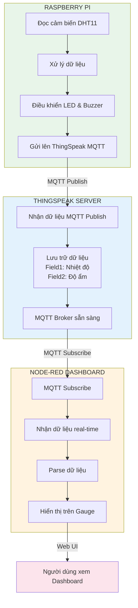
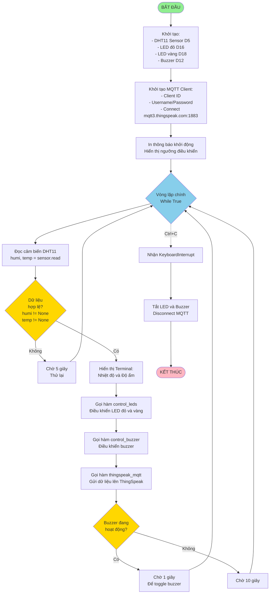
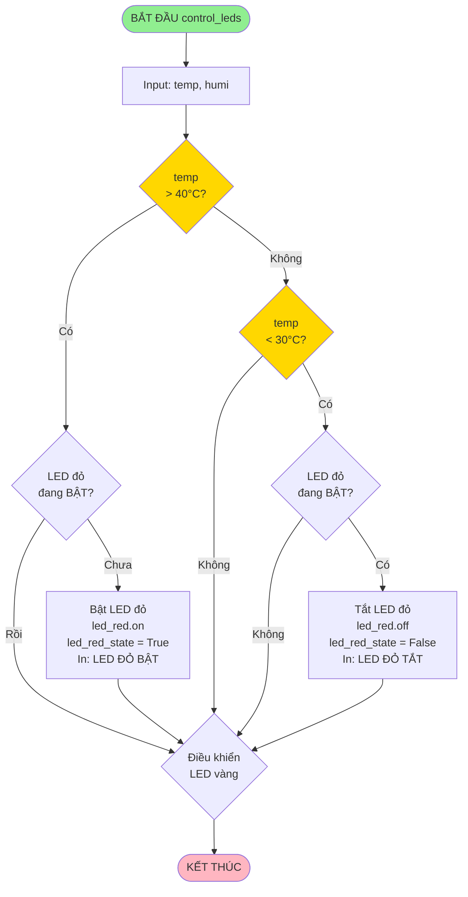
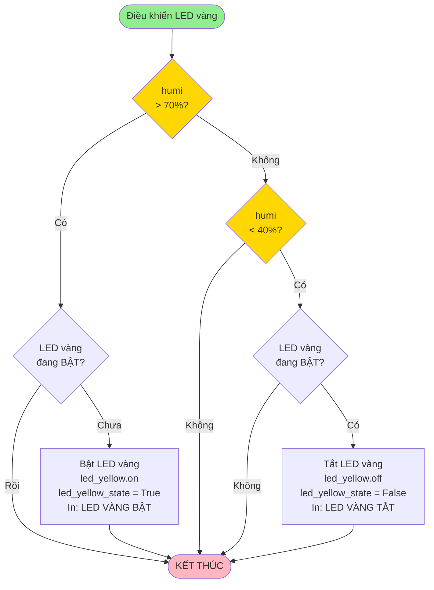
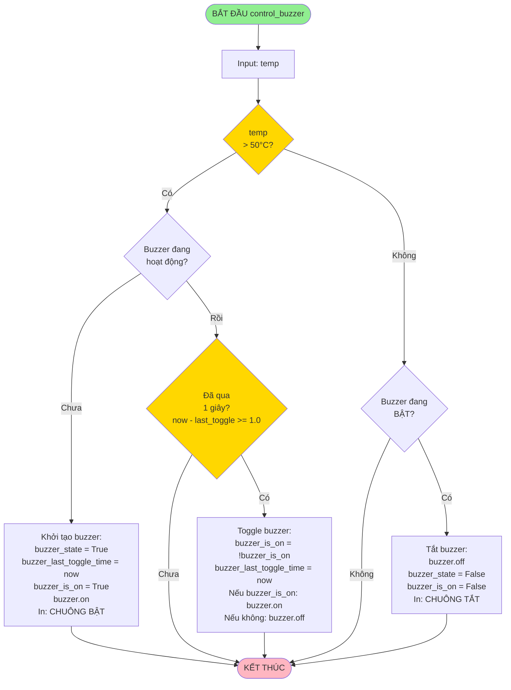
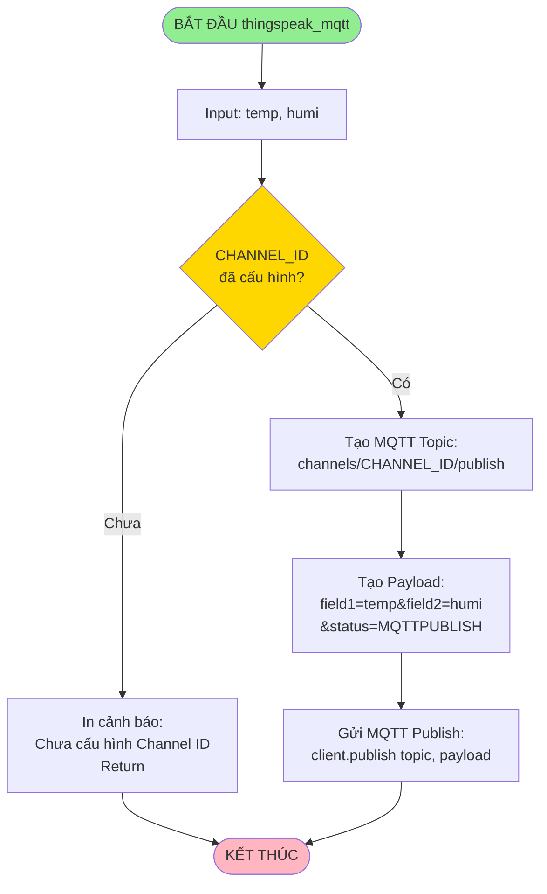
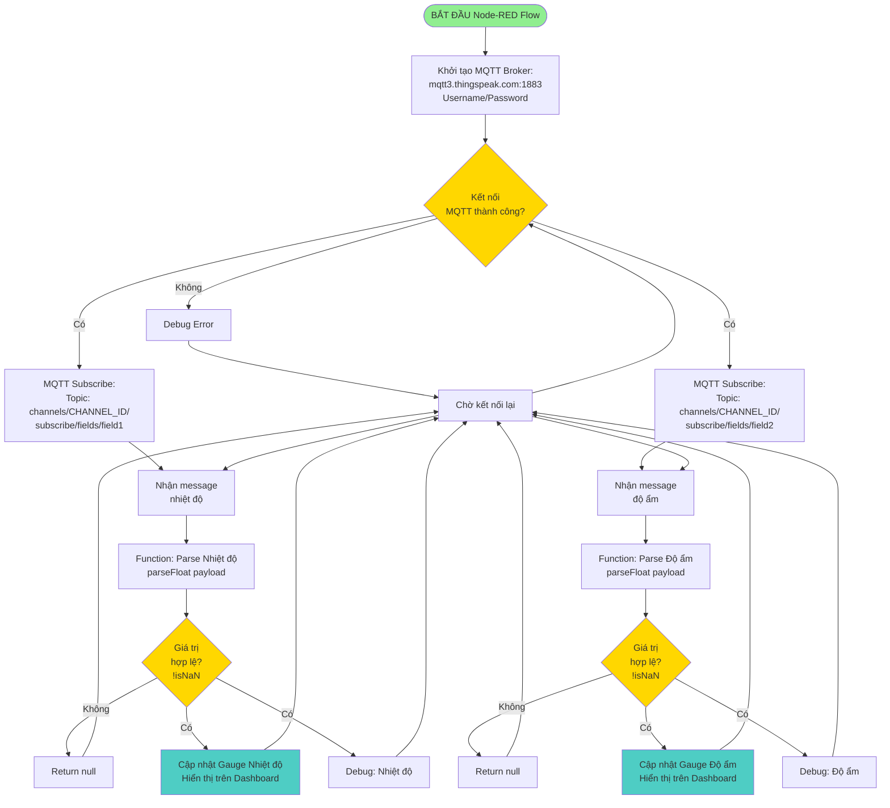
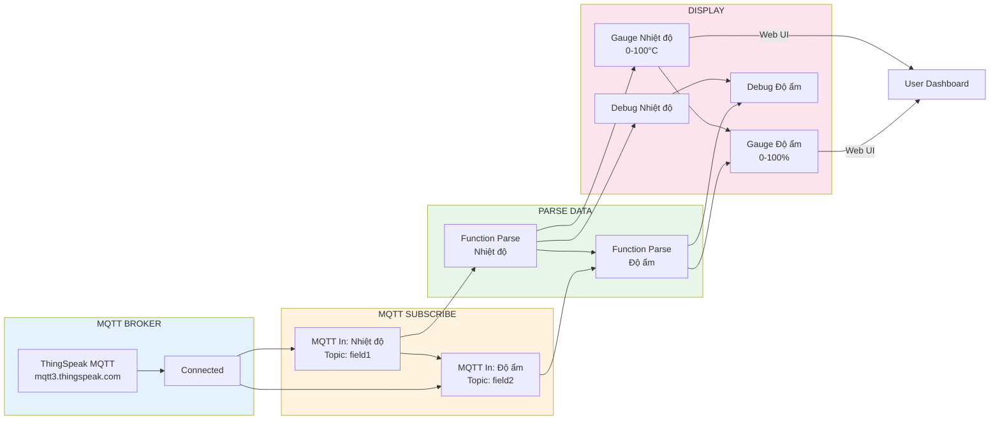
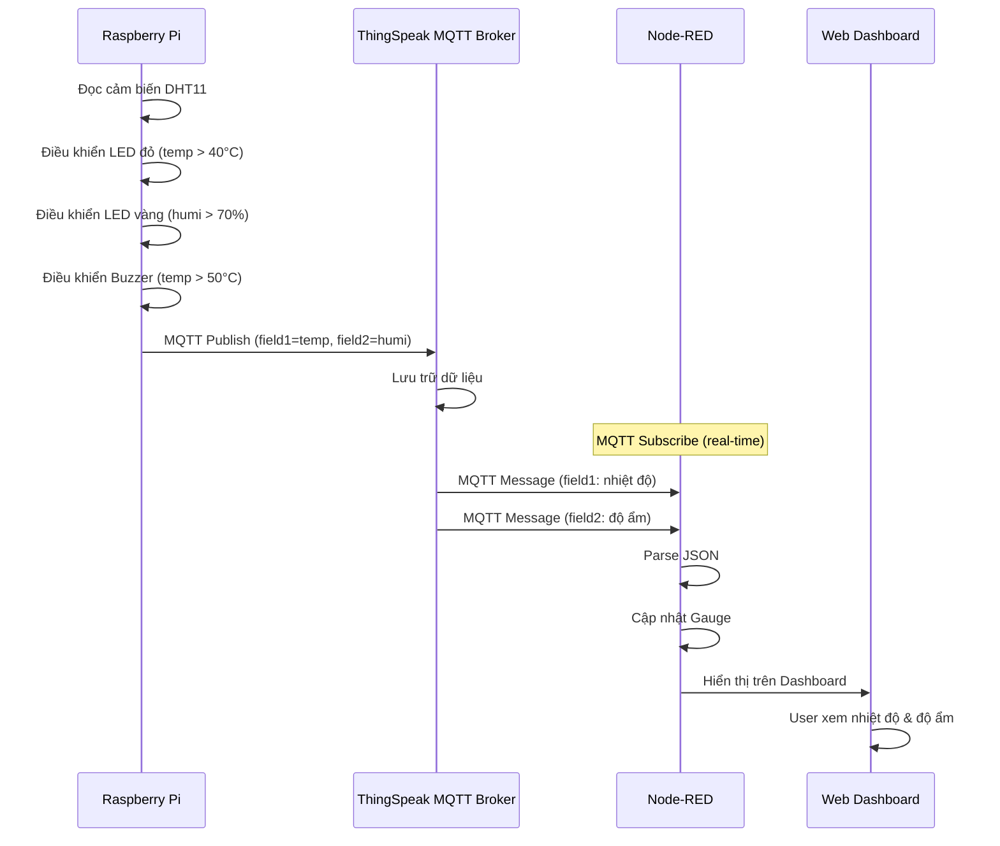
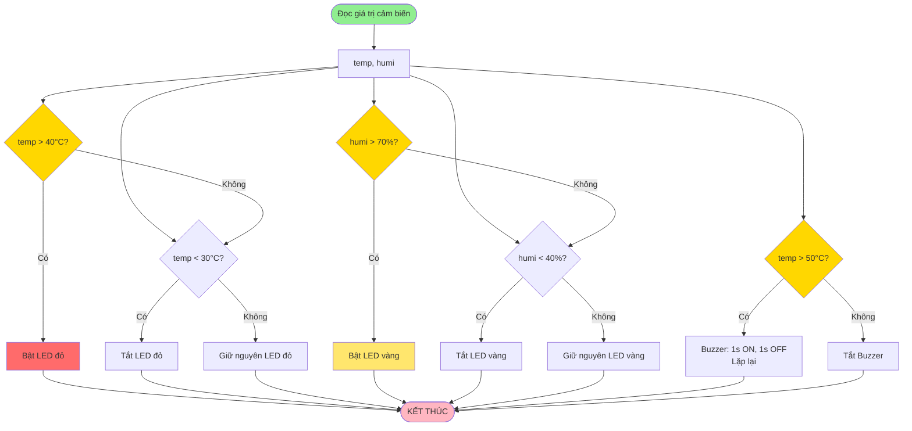

# Lưu đồ giải thuật - Hệ thống giám sát nhiệt độ và độ ẩm với ThingSpeak MQTT

## 1. Lưu đồ tổng quan hệ thống

## 2. Lưu đồ chương trình Python (Raspberry Pi) - Chương trình chính

## 3. Lưu đồ điều khiển LED đỏ (theo nhiệt độ)

## 4. Lưu đồ điều khiển LED vàng (theo độ ẩm)

## 5. Lưu đồ điều khiển Buzzer (theo nhiệt độ)

## 6. Lưu đồ gửi dữ liệu lên ThingSpeak (MQTT Publish)

## 7. Lưu đồ Node-RED nhận và hiển thị dữ liệu (MQTT)

## 8. Lưu đồ chi tiết Node-RED Flow

## 9. Lưu đồ luồng dữ liệu tổng thể (MQTT)

## 10. Lưu đồ logic điều khiển thiết bị

## Mô tả các thành phần:

### Raspberry Pi (Python):
- **Cảm biến**: DHT11 đọc nhiệt độ và độ ẩm (D5)
- **LED đỏ**: Grove LED (D16) - bật khi nhiệt độ > 40°C, tắt khi < 30°C
- **LED vàng**: Grove LED (D18) - bật khi độ ẩm > 70%, tắt khi < 40%
- **Buzzer**: Grove Buzzer (D12) - 1s bip, 1s không, lặp lại khi nhiệt độ > 50°C
- **Gửi dữ liệu**: MQTT Publish lên ThingSpeak (real-time)
- **Đọc cảm biến**: Mỗi 10 giây (hoặc 1 giây nếu buzzer hoạt động)

### ThingSpeak MQTT Broker:
- **Nhận dữ liệu**: Qua MQTT Publish từ Raspberry Pi
- **Lưu trữ**: 
  - Field1: Nhiệt độ (°C)
  - Field2: Độ ẩm (%)
- **MQTT Broker**: `mqtt3.thingspeak.com:1883`
- **Topic Publish**: `channels/[CHANNEL_ID]/publish`
- **Topic Subscribe**: `channels/[CHANNEL_ID]/subscribe/fields/field1` và `field2`

### Node-RED Dashboard (MQTT):
- **MQTT Broker**: Kết nối với ThingSpeak MQTT
- **MQTT Subscribe**: Subscribe các topic field1 và field2
- **Parse**: Chuyển đổi payload sang số (parseFloat)
- **Hiển thị**: 
  - Gauge cho nhiệt độ (0-100°C)
  - Gauge cho độ ẩm (0-100%)
- **Truy cập**: `http://localhost:1880/ui` hoặc `http://[IP]:1880/ui`

### Logic điều khiển:
- **LED đỏ**: 
  - Bật khi nhiệt độ > 40°C
  - Tắt khi nhiệt độ < 30°C
  - Giữ nguyên khi 30°C ≤ nhiệt độ ≤ 40°C
- **LED vàng**: 
  - Bật khi độ ẩm > 70%
  - Tắt khi độ ẩm < 40%
  - Giữ nguyên khi 40% ≤ độ ẩm ≤ 70%
- **Buzzer**: 
  - Bật khi nhiệt độ > 50°C
  - Chế độ: 1 giây ON, 1 giây OFF, lặp lại
  - Tắt khi nhiệt độ ≤ 50°C

### Ngưỡng điều khiển:
- **TEMP_THRESHOLD_HIGH**: 40°C (bật LED đỏ)
- **TEMP_THRESHOLD_LOW**: 30°C (tắt LED đỏ)
- **TEMP_BUZZER_THRESHOLD**: 50°C (bật buzzer)
- **HUMI_THRESHOLD_HIGH**: 70% (bật LED vàng)
- **HUMI_THRESHOLD_LOW**: 40% (tắt LED vàng)

### Ưu điểm MQTT:
- **Real-time**: Dữ liệu được gửi và nhận ngay lập tức
- **Hiệu quả**: Giao thức nhẹ, tiết kiệm băng thông
- **Đáng tin cậy**: QoS đảm bảo gửi nhận dữ liệu
- **Không cần polling**: Không cần gửi request liên tục như HTTP

### Xử lý lỗi:
- **Lỗi đọc cảm biến**: Gán giá trị None và thử lại sau 5 giây
- **Lỗi MQTT**: In thông báo lỗi và tiếp tục vòng lặp
- **KeyboardInterrupt**: Tắt tất cả thiết bị, disconnect MQTT và thoát an toàn

