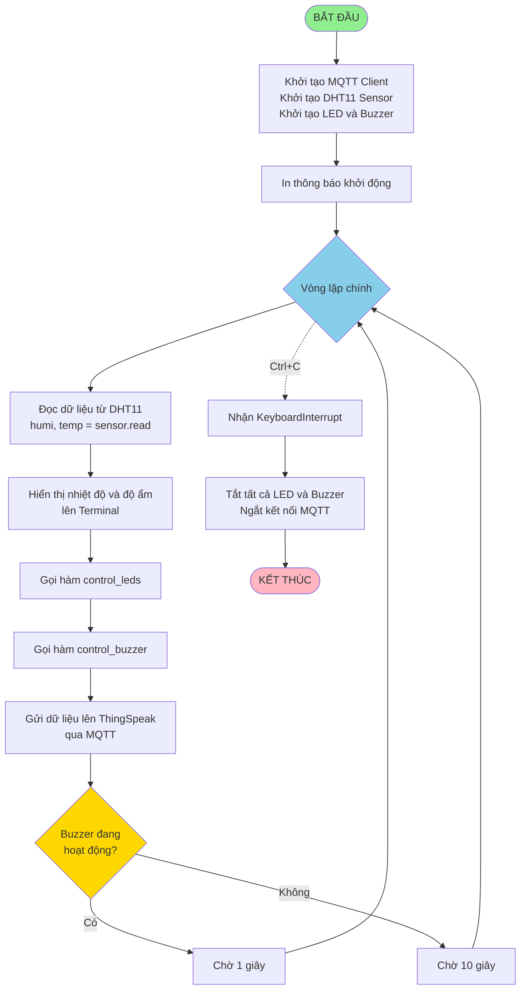
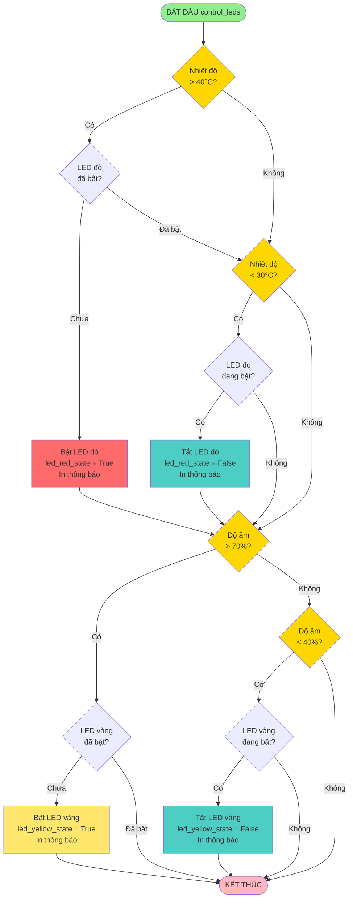
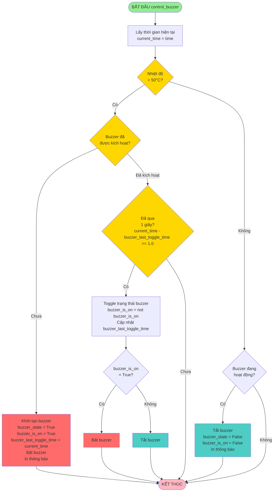
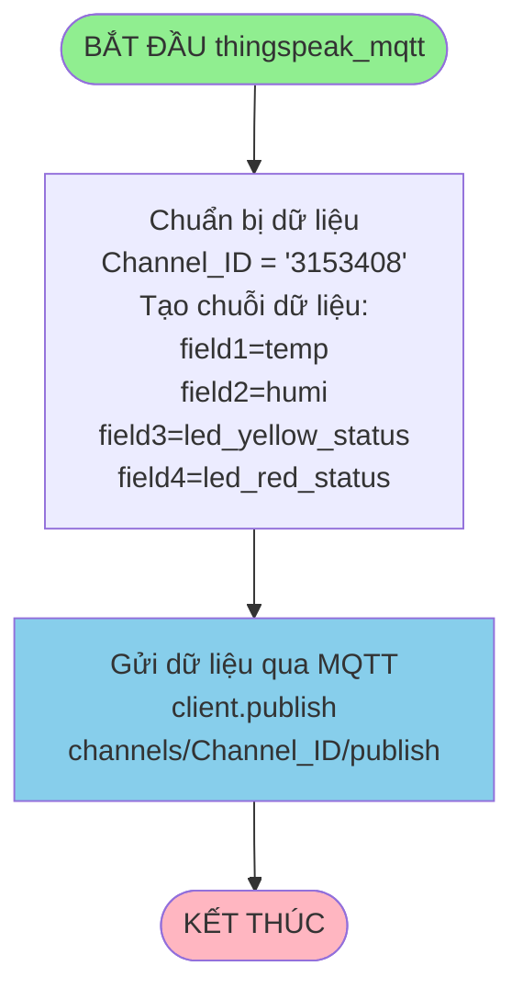
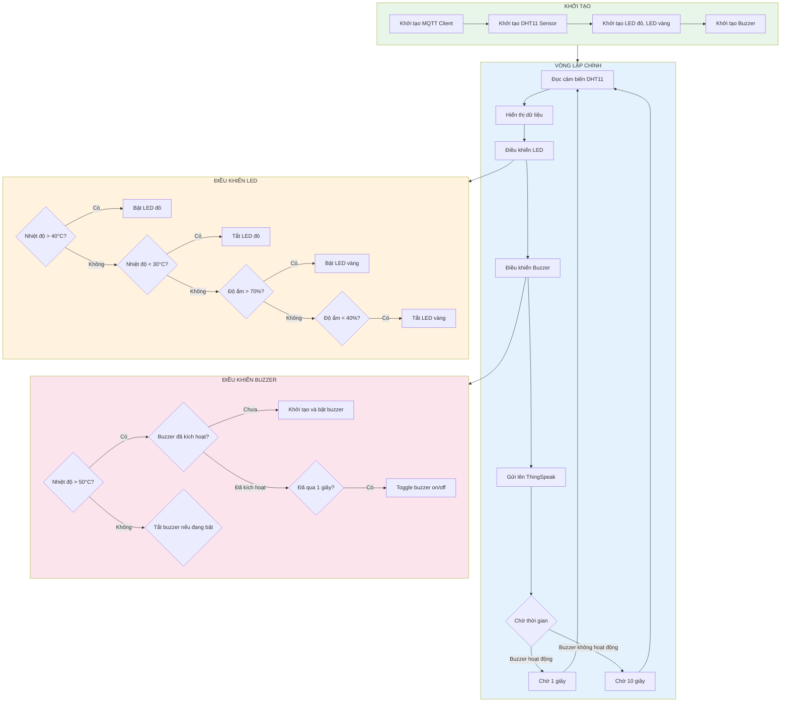

# Lưu đồ giải thuật - Hệ thống giám sát nhiệt độ và độ ẩm

## 1. Lưu đồ chương trình chính (main)

## 2. Lưu đồ điều khiển LED (control_leds)

## 3. Lưu đồ điều khiển Buzzer (control_buzzer)

## 4. Lưu đồ gửi dữ liệu lên ThingSpeak (thingspeak_mqtt)

## 5. Lưu đồ tổng quan hệ thống

## Mô tả các thành phần:

### Khởi tạo:
- **MQTT Client**: Kết nối với ThingSpeak qua MQTT
- **DHT11 Sensor**: Cảm biến nhiệt độ và độ ẩm (port D5)
- **LED đỏ**: Pin 16, cảnh báo nhiệt độ
- **LED vàng**: Pin 18, cảnh báo độ ẩm
- **Buzzer**: Pin 12, cảnh báo âm thanh

### Logic điều khiển:
- **LED đỏ**: Bật khi temp > 40°C, tắt khi temp < 30°C
- **LED vàng**: Bật khi humi > 70%, tắt khi humi < 40%
- **Buzzer**: Bật/tắt mỗi 1 giây khi temp > 50°C

### Gửi dữ liệu:
- Gửi nhiệt độ, độ ẩm và trạng thái LED lên ThingSpeak mỗi chu kỳ

