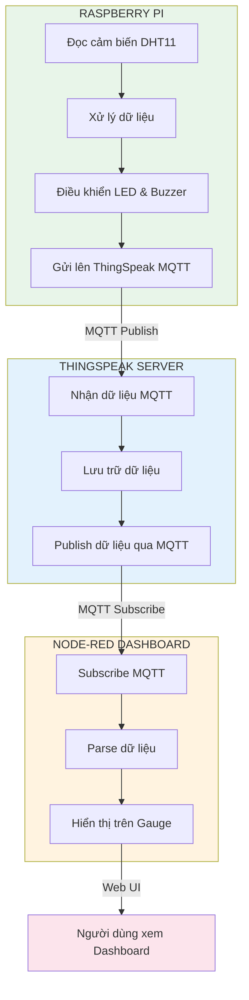
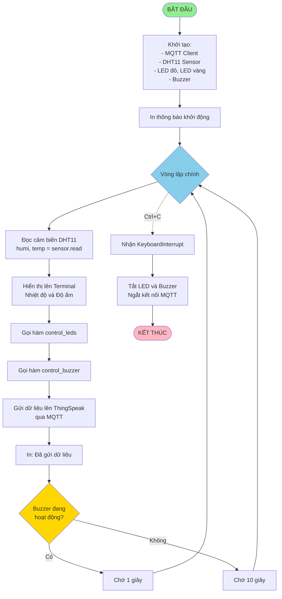
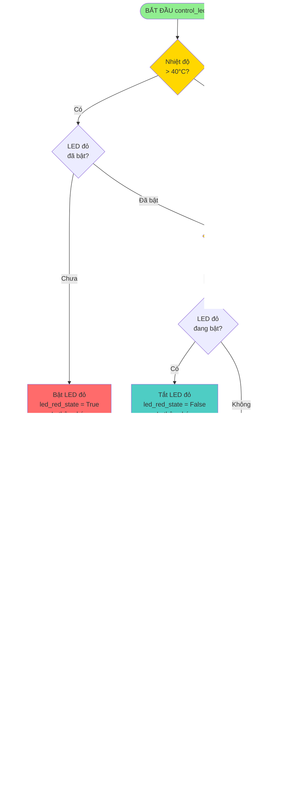
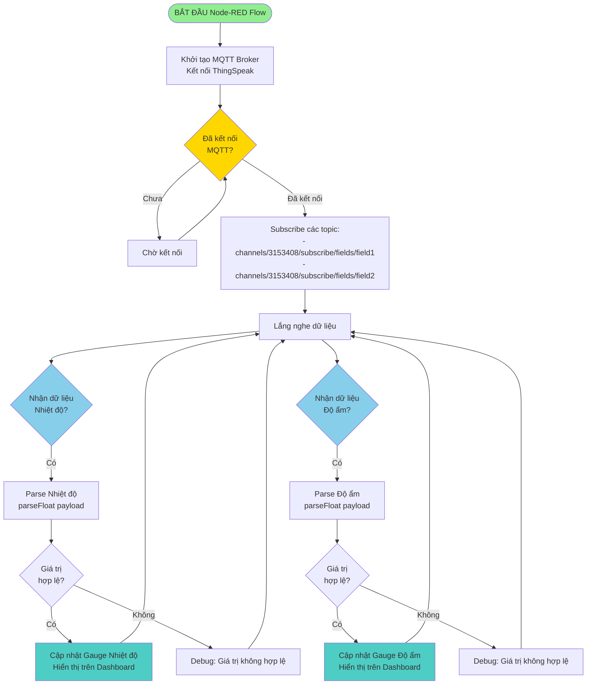
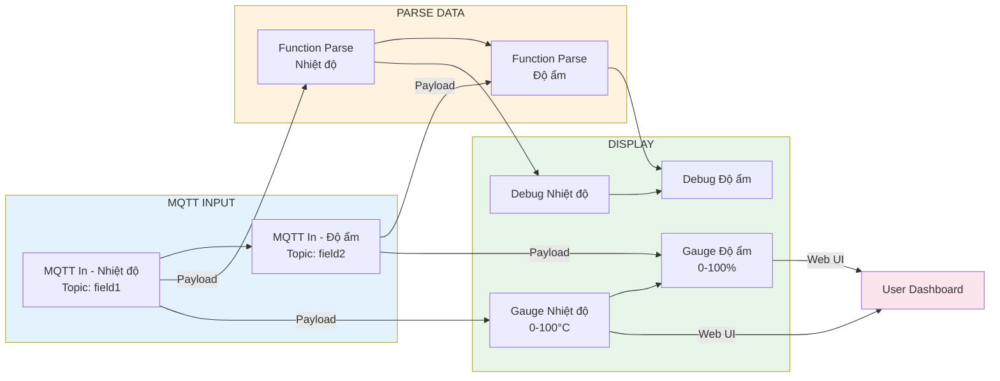
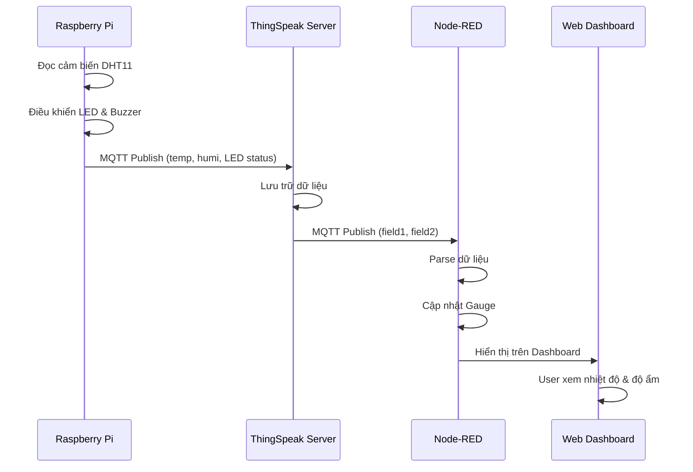

# Lưu đồ giải thuật - Hệ thống giám sát nhiệt độ và độ ẩm với Node-RED Dashboard

## 1. Lưu đồ tổng quan hệ thống

## 2. Lưu đồ chương trình Python (Raspberry Pi)

## 3. Lưu đồ điều khiển LED (control_leds)

## 4. Lưu đồ điều khiển Buzzer (control_buzzer)

## 5. Lưu đồ gửi dữ liệu lên ThingSpeak (thingspeak_mqtt)

## 6. Lưu đồ Node-RED nhận và hiển thị dữ liệu

## 7. Lưu đồ chi tiết Node-RED Flow

## 8. Lưu đồ luồng dữ liệu tổng thể

## Mô tả các thành phần:

### Raspberry Pi (Python):
- **Cảm biến**: DHT11 đọc nhiệt độ và độ ẩm
- **Điều khiển**: LED đỏ (nhiệt độ), LED vàng (độ ẩm), Buzzer (cảnh báo)
- **Gửi dữ liệu**: MQTT Publish lên ThingSpeak mỗi 10 giây (hoặc 1 giây nếu buzzer hoạt động)

### ThingSpeak Server:
- **Nhận dữ liệu**: Qua MQTT từ Raspberry Pi
- **Lưu trữ**: Field1 (nhiệt độ), Field2 (độ ẩm), Field3 (LED vàng), Field4 (LED đỏ)
- **Publish**: Gửi lại dữ liệu qua MQTT cho các subscriber

### Node-RED Dashboard:
- **Subscribe**: Nhận dữ liệu từ ThingSpeak qua MQTT
- **Parse**: Chuyển đổi string sang số
- **Hiển thị**: Gauge trên giao diện web
- **Truy cập**: `http://localhost:1880/ui` hoặc `http://[IP]:1880/ui`

### Logic điều khiển:
- **LED đỏ**: Bật khi temp > 40°C, tắt khi temp < 30°C
- **LED vàng**: Bật khi humi > 70%, tắt khi humi < 40%
- **Buzzer**: Bật/tắt mỗi 1 giây khi temp > 50°C
