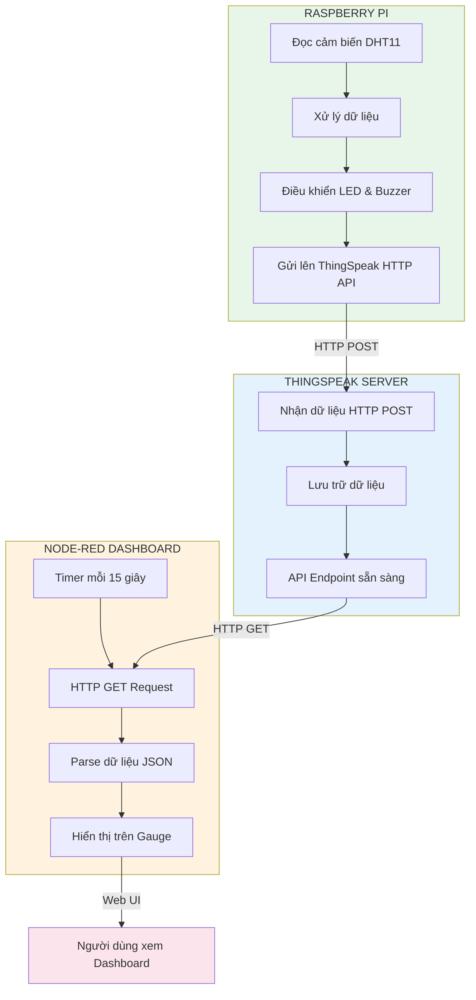
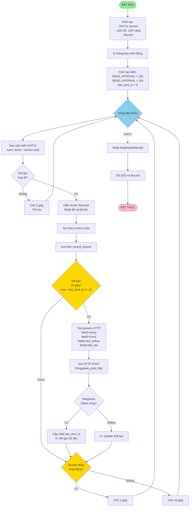
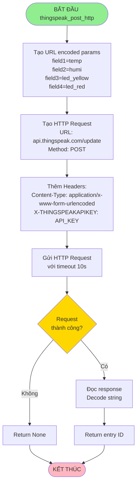
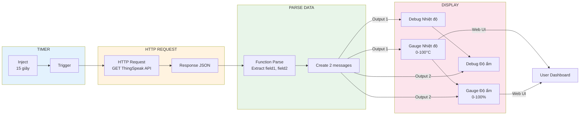
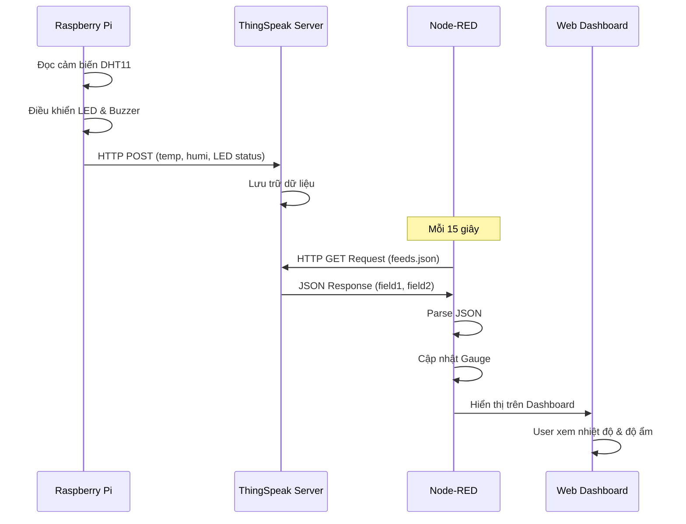
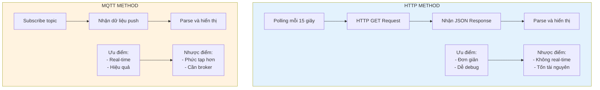

# Lưu đồ giải thuật - Hệ thống giám sát nhiệt độ và độ ẩm với Node-RED Dashboard (HTTP)

## 1. Lưu đồ tổng quan hệ thống



## 2. Lưu đồ chương trình Python (Raspberry Pi)



## 3. Lưu đồ gửi dữ liệu lên ThingSpeak (HTTP POST)



## 4. Lưu đồ Node-RED nhận và hiển thị dữ liệu (HTTP)

```mermaid
flowchart TD
    Start([BẮT ĐẦU Node-RED Flow]) --> InitTimer[Inject Timer<br/>Repeat: 15 giây]
    InitTimer --> Trigger[Kích hoạt mỗi 15 giây]
    
    Trigger --> HTTPRequest[HTTP Request Node<br/>GET: api.thingspeak.com/channels/3153408/feeds.json<br/>results=1&api_key=READ_API_KEY]
    
    HTTPRequest --> CheckResponse{Response<br/>thành công?}
    
    CheckResponse -->|Không| Error[Debug Error]
    Error --> Wait[Chờ lần trigger tiếp theo]
    
    CheckResponse -->|Có| ParseJSON[Function: Parse JSON<br/>Lấy feeds[0]]
    ParseJSON --> CheckFeeds{feeds<br/>có dữ liệu?}
    
    CheckFeeds -->|Không| ReturnNull[Return null]
    CheckFeeds -->|Có| ExtractData[Lấy field1 và field2<br/>Parse sang float]
    
    ExtractData --> CheckValid{Giá trị<br/>hợp lệ?}
    
    CheckValid -->|Không| ReturnNull
    CheckValid -->|Có| CreateMessages[Tạo 2 messages:<br/>msgTemp: payload=temp<br/>msgHumi: payload=humi]
    
    CreateMessages --> OutputTemp[Output 1: Nhiệt độ]
    CreateMessages --> OutputHumi[Output 2: Độ ẩm]
    
    OutputTemp --> UpdateGaugeTemp[Cập nhật Gauge Nhiệt độ<br/>Hiển thị trên Dashboard]
    OutputTemp --> DebugTemp[Debug: Nhiệt độ]
    
    OutputHumi --> UpdateGaugeHumi[Cập nhật Gauge Độ ẩm<br/>Hiển thị trên Dashboard]
    OutputHumi --> DebugHumi[Debug: Độ ẩm]
    
    UpdateGaugeTemp --> Wait
    UpdateGaugeHumi --> Wait
    DebugTemp --> Wait
    DebugHumi --> Wait
    ReturnNull --> Wait
    Wait --> Trigger
    
    style Start fill:#90EE90
    style CheckResponse fill:#FFD700
    style CheckFeeds fill:#FFD700
    style CheckValid fill:#FFD700
    style UpdateGaugeTemp fill:#4ECDC4
    style UpdateGaugeHumi fill:#4ECDC4
```

## 5. Lưu đồ chi tiết Node-RED Flow



## 6. Lưu đồ luồng dữ liệu tổng thể (HTTP)



## 7. So sánh HTTP vs MQTT



## Mô tả các thành phần:

### Raspberry Pi (Python - HTTP):
- **Cảm biến**: DHT11 đọc nhiệt độ và độ ẩm
- **Điều khiển**: LED đỏ (nhiệt độ), LED vàng (độ ẩm), Buzzer (cảnh báo)
- **Gửi dữ liệu**: HTTP POST lên ThingSpeak mỗi 15 giây (rate limit)
- **Đọc cảm biến**: Mỗi 10 giây (hoặc 1 giây nếu buzzer hoạt động)

### ThingSpeak Server:
- **Nhận dữ liệu**: Qua HTTP POST từ Raspberry Pi
- **Lưu trữ**: Field1 (nhiệt độ), Field2 (độ ẩm), Field3 (LED vàng), Field4 (LED đỏ)
- **API Endpoint**: `https://api.thingspeak.com/channels/3153408/feeds.json`

### Node-RED Dashboard (HTTP):
- **Timer**: Inject node kích hoạt mỗi 15 giây
- **HTTP Request**: GET dữ liệu từ ThingSpeak API
- **Parse**: Chuyển đổi JSON sang số
- **Hiển thị**: Gauge trên giao diện web
- **Truy cập**: `http://localhost:1880/ui` hoặc `http://[IP]:1880/ui`

### Logic điều khiển:
- **LED đỏ**: Bật khi temp > 40°C, tắt khi temp < 30°C
- **LED vàng**: Bật khi humi > 70%, tắt khi humi < 40%
- **Buzzer**: Bật/tắt mỗi 1 giây khi temp > 50°C

### Rate Limits:
- **ThingSpeak HTTP**: Tối đa 1 request mỗi 15 giây
- **Python**: Gửi mỗi 15 giây, đọc cảm biến mỗi 10 giây

